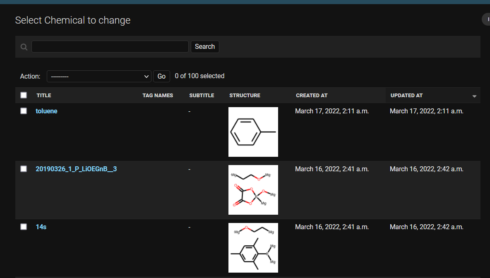
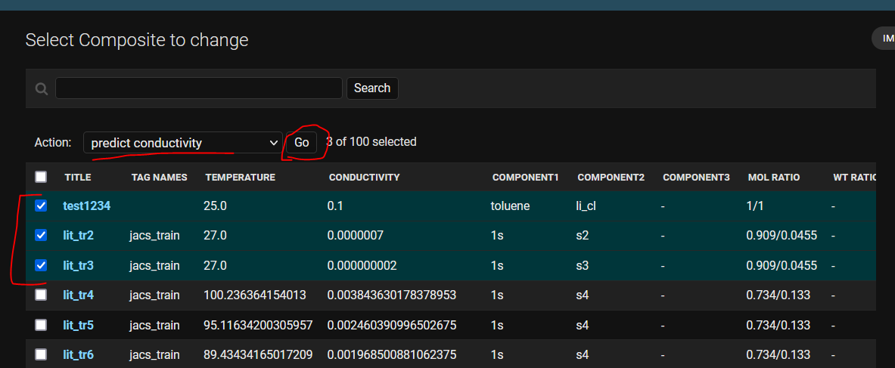
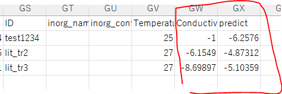
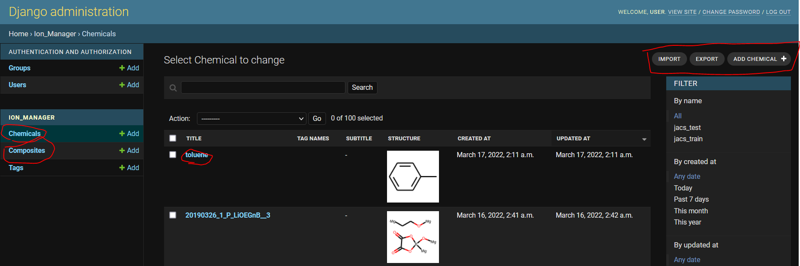

# Ionic conductivity predictor 
- Database of Li conducting liquid and solid electrolytes (organic)
    - polymers, liquids, etc
- Predict thier ionic conductivity by machine learning
- Related paper
    - https://pubs.acs.org/doi/10.1021/jacs.9b11442
    - Database and models are slightly different from the original paper
        - i.e., copyright and available module version issues


# How to use?
## [DEMO server](https://ionpred.herokuapp.com/admin/) is available!
-  Just wait for ca. 30 seconds to load the page
- Login info
    - username: user
    - pass: user
- Database will reset every day
- Response is slow because it runs on a free server


# Overview
## Chemical database

## Electrolyte database

## Predicted conductivity
- It can export the prediction data as a csv file
- Log10 (conductivity) is predicted

## where is the database?
- [csv files](database) are available!
- SQL database is used in the server


# Installization
## For computer beginners
- The system works on [Django framework](https://docs.djangoproject.com) of Python
    - Basic knowledge of Python and Django would be needed to run the program
- However, you can try [VirtualBox](https://www.virtualbox.org/).
    - [Virtual Box image](https://drive.google.com/drive/folders/1blh2ysu-766BYBRP9J_iByIbmjkD4GW-?usp=sharing) (2022/4/5, ca. 10 GB)
    - Files were not checked seriously

### On your server 
1. Clone this repositry
    1. For instance,
        - ```gh repo clone KanHatakeyama/ion_predictor```
    2. Unzip database
        - ```7z x db.7z```
2. Setup Python environment according to "requirements.txt"
    - Or, manually run the commands [here](misc/conda_command) 
3. Run server
    - ```python manage.py runserver```
    - Or, by other command, such as 
        - ```gunicorn -b :8765 config.wsgi```
4. Access website
5. You can login the site with
    - Username: user
    - Pass: user

### On [Heroku](https://heroku.com/) (via docker)
1. Clone this repositry
    1. For instance,
        - ```gh repo clone KanHatakeyama/ion_predictor```
    2. Unzip database
        - ```7z x db.7z```
2. Login heroku via CLI
    - ```heroku login --interactive ```
3. Run the following commands
    - ```heroku create [your heroku project name]```
    - ```heroku container:login```
    - ```heroku stack:set container```
    - ```heroku container:push web -a [your heroku project name]```
    - ```heroku container:release web -a [your heroku project name]```

### Docker (not checked)
1. Clone this repositry
    1. For instance,
        - ```gh repo clone KanHatakeyama/ion_predictor```
    2. Unzip database
        - ```7z x db.7z```
2. Build image
    - ```docker build -t ion .```
3. Run (e.g., @ PORT=8000)
    - ```docker run -e PORT=8000 ion```

# Quick use
## GUI
- Run server
- Access URL
    - e.g., http://127.0.0.1:8000/
- Edit chemical and electrolyte data
    - You can import and export data as e.g., xlsx and csv


## Jupyter
- Launch [notebook](prepare_model.ipynb)
- You can tune neural descriptors, etc

# Version
- 2022.3.17 First prototype

# TODO & issues
- Prepare manual
- Error occurs during exporting/importing large records (e.g., dump all composite data)
    - this seems to be induced by a timeout error of wsgi
    - launched server by django should not cause the error
        - ```python manage.py runserver```

# Author
- Kan Hatakeyama-Sato
- Waseda University
- https://kanhatakeyama.github.io/
- satokan@toki.waseda.(japan)