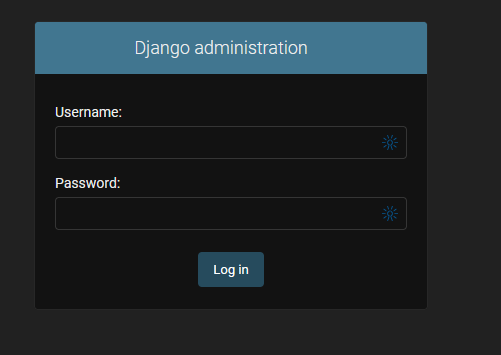
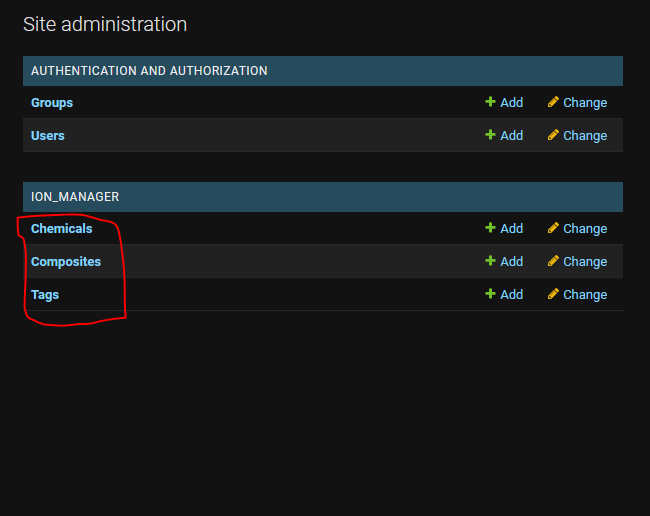
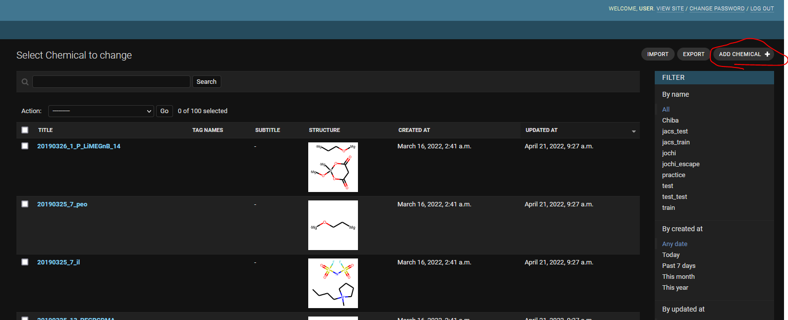
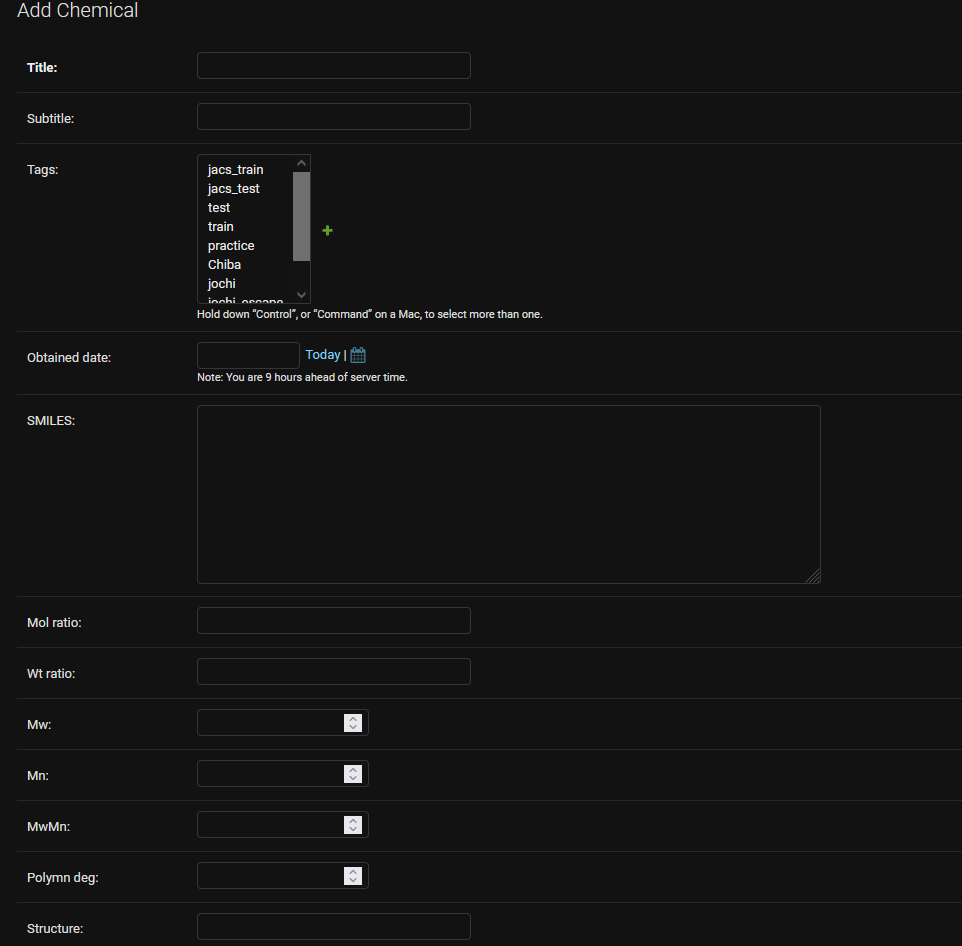
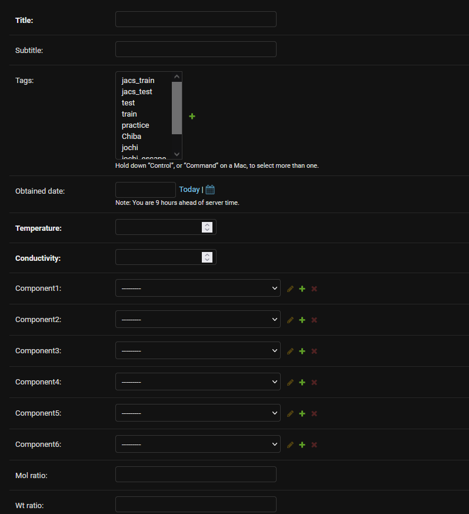
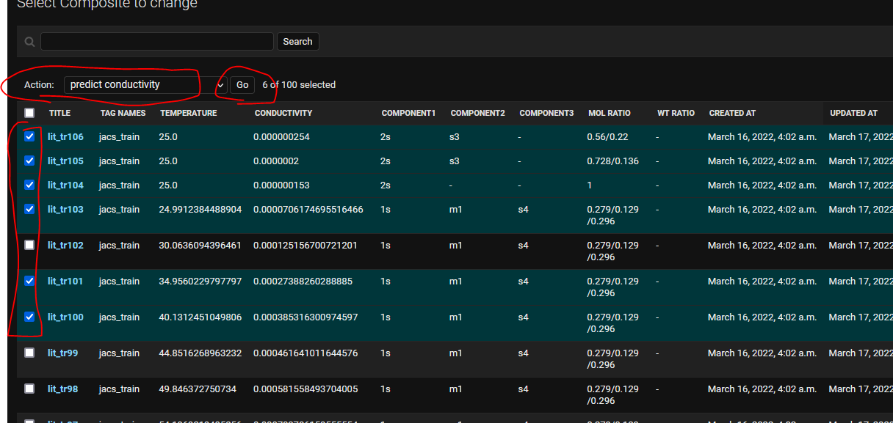
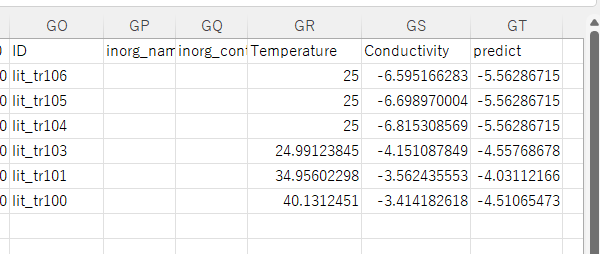

# TOC
- [TOC](#toc)
- [1. Installization](#1-installization)
  - [NOTE: For programming beginners](#note-for-programming-beginners)
  - [Choive A: On your computer via Docker (recommended)](#choive-a-on-your-computer-via-docker-recommended)
  - [Choice A': On your computer (manual install)](#choice-a-on-your-computer-manual-install)
  - [Choice B: On Heroku (remote webserver via docker)](#choice-b-on-heroku-remote-webserver-via-docker)
- [2. Overview for using the program](#2-overview-for-using-the-program)
  - [GUI](#gui)
  - [Jupyter](#jupyter)
- [3. Data management and predict conductivity](#3-data-management-and-predict-conductivity)
  - [3.1 Launch server](#31-launch-server)
  - [3.2 Register chemicals](#32-register-chemicals)
  - [3.3 Register composites](#33-register-composites)
  - [3.4 Predict conductivty](#34-predict-conductivty)
  - [3.5 Import/export data](#35-importexport-data)
- [(under devlopment)](#under-devlopment)
- [4. TODO & issues](#4-todo--issues)


# 1. Installization
## NOTE: For programming beginners
- The system works on [Django framework](https://docs.djangoproject.com) of Python
    - Basic knowledge of Python and Django would be needed to run the program
- However, you can try [VirtualBox](https://www.virtualbox.org/).
    - [Virtual Box image](https://drive.google.com/drive/folders/1blh2ysu-766BYBRP9J_iByIbmjkD4GW-?usp=sharing) (2022/4/5, ca. 10 GB)
    - Files were not checked very carefully
    - It may not be the newest version

## Choive A: On your computer via Docker (recommended)
0. [Install docker](https://docs.docker.com/get-docker/)
    - Docker is virtual environment of computing
1. Clone this repositry
    1. For instance,
        - ```gh repo clone KanHatakeyama/ion_predictor```
    2. Unzip database
        - ```7z x db.7z```
2. Build image
    - ```docker build -t ion .```
3. Run (e.g., @ PORT=8000)
    - ```docker run -p 8000:8000 -it ion```
4. In the docker, activate python environment
    - ```conda activate chemodel```
5. Launch server
    - ```python manage.py runserver 0.0.0.0:8000```
    - Access website via your browser
    - You can login the site with
      - Username: user
      - Pass: user
6. Launch jupyter notebook (for machine learning)
    - ```jupyter-notebook --port 8000 --allow-root --ip 0.0.0.0```


## Choice A': On your computer (manual install)
1. Clone this repositry
    1. For instance,
        - ```gh repo clone KanHatakeyama/ion_predictor```
    2. Unzip database
        - ```7z x db.7z```
2. Setup Python environment according to "requirements.txt"
    - Or, manually run the commands [here](../misc/conda_command) 
3. Run server
    - ```python manage.py runserver 0.0.0.0:8000```
    - Or, by other command, such as 
        - ```gunicorn -b :8765 config.wsgi```
4. Access website and jupyter(same as A)


## Choice B: On [Heroku](https://heroku.com/) (remote webserver via docker)

1. Clone this repositry
    1. For instance,
        - ```gh repo clone KanHatakeyama/ion_predictor```
    2. Unzip database
        - ```7z x db.7z```
    3. Modify [Dockerfile](../Dockerfile)
    - Remove "comment out (#)" for the following commands (essential for Heroku server)
        - ```RUN pip3 install --no-deps django-heroku```
        - ```CMD gunicorn --bind 0.0.0.0:$PORT config.wsgi```
2. Login heroku via CLI
    - ```heroku login --interactive ```
3. Run the following commands
    - ```heroku create [your heroku project name]```
    - ```heroku container:login```
    - ```heroku stack:set container```
    - ```heroku container:push web -a [your heroku project name]```
    - ```heroku container:release web -a [your heroku project name]```

# 2. Overview for using the program 
## GUI
- Run server
- Access the program
    - e.g., http://127.0.0.1:8000/
- Edit chemical and electrolyte data
    - You can import and export data as e.g., xlsx and csv

## Jupyter
- Launch [jupyter notebook](../prepare_model.ipynb)
- You can tune neural descriptors, etc


# 3. Data management and predict conductivity
## 3.1 Launch server
1. Launch the server
    - Example commands
      - Normal launch
        - ```python manage.py runserver```
      - For remote access with the port of 8765
          - ```python manage.py runserver 0.0.0.0:8765```
    - Please check [Django document](https://docs.djangoproject.com/en/4.0/ref/django-admin/) for details about launching the command
        - Note that this command is only for deveplment

2. Access the server with your browser
    - e.g., http://127.0.0.1:8000/
    - You will visit a login page

    - Enter username and password
      - Default:
        - username: user
        - password: user
3. Admin page

    - There are three important pages
        - Chemicals
          - Edit chemical structures for electrolytes
        - Composites
          - Edit electrolyte information and their properties
        - Tags
          - Edit tags for records
## 3.2 Register chemicals
   - Let's register a new chemical!
1. Move to the registration page
   - 
2. Register chemical info
   - 
      - Title
        - Your favorite name
      - SMILES
        - SMILES string of chemicals
          - Edit chemicals by e.g., ChemDraw
          - For polymers, please cap the repeating units with "Mg" atoms
          - You should not input Li+ in the smiles
            - e.g., input only Cl- for LiCl
      - mol_ratio
        - molar ratio of chemicals in the case of copolymers
      - wt_ratio
        - weight ratio of chemicals in the case of copolymers
      - ...

## 3.3 Register composites
   - Let's register a new composite!
   - 
     - Temperature
       - Measuring temperature of ionic conductivity
     - Conductivity
       - Ionic conductivity
     - Component 1,2,...
       - Select chemical components for an electrolyte
            - You don't have to care about the order of chemicals
            - During machine learning, the program will sort it automatically
     - mol_ratio
       - molar ratio of the components
     - ...

## 3.4 Predict conductivty
    - You can easily predict conductivity of electrolytes via the GUI interface
   - 
1. Select records which you want to predict
2. Select "predict conductivity"
3. Click "go" button

   - Prediction data will be downloaded
   - 
    - Move to the right end column
      - You can check the predicted and actual conductivities, etc.
        - Log10(conductivity) is shown
      - Other columns are explanatory variables for prediction
        - mainly consisting of ...
          - neural descriptors of consisting chemicals
          - their weight ratio
          - molecular weight
          - ...

## 3.5 Import/export data

# (under devlopment)

# 4. TODO & issues
- Error occurs during exporting/importing large records (e.g., dump all composite data)
    - this seems to be induced by a timeout error of wsgi
    - launching server by django will not cause the error
        - ```python manage.py runserver```

